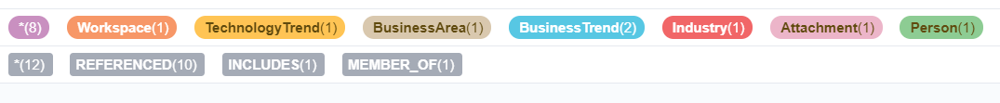
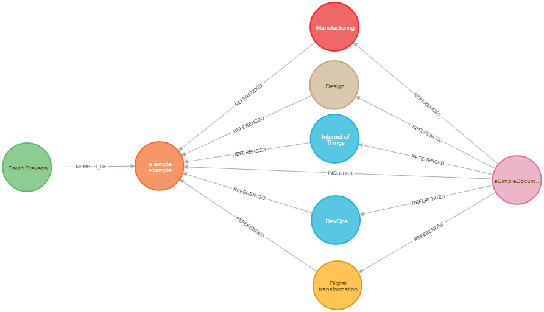

# A Digital Dictionary
David Stevens 
DXC Distinguished Architect 
DXC Technology Office 

---

Information for any topic is available at the touch of a button or screen; available from multiple sources and at varying levels of quality.   Having a high level of confidence from an information source is paramount for an organisation to make assured decisions and take the appropriate actions.

As a result of the core Digital Explorer work and the a number of side projects harnessing various aspect of the information we have captured within the platform; the trust and position of Digital Explorer as the source of Digital relevance has become apparent.   DXC Digital Explorer is becoming the Digital Dictionary for DXC technology.

This is now realized in a new update available within the Workspace module; a simple yet very powerful concept.

**Q: Can I upload a document or presentation and extract the key digital drivers and information from it?**

 

Of course the answer is yes and it's a result of a number of smaller prototype projects I have been a part of, both within DXC and as personal side project mainly centred around the principle of being "lazy smart" ~ see reference work.

The first implementation within DXC Digital Explorer is fairly simple; a match against key digital references.

1. Industries and Sub-Industries
1. Key business areas being disrupted by Digital Transformation
1. Digital Industry Trends
1. Technology Trends

Simple put it's  `lower(document.text) CONTAINS lower(IndustryName)` etc.

This results in a very valuable set of information from each uploaded document.

 
 

Note from the diagram we are also counting and storing the number of times the match is made; this will allow us to do more with the information in a future release.

## Further use cases
This is just the first implementation of this new feature; extended use cases we are reviewing

1. recommendation based on extracted content (solutions & people)
1. similarity between a "request" and a "response"

### Challenges raised
A Digital dictionary brings initial high value, but what is already apparent is the need for a digital thesaurus.  The Digital Explorer platform currently uses [WordNet](https://wordnet.princeton.edu/) to help with the similarity matching within it's search engine; however the simple similarity between words in the English language is not enough for a wider range of industry use cases; for example the means to extract "IAAS" from a document and find and connect to "Infrastructure as a Service" or even "Cloud Computing".   Extend this further and given the need for industry focused solution further ontologies are required

[DIAGRAM OF THE ONTOLOGY LAYERS]

----
#### Reference work
[1] [NLP within Graph June 2017 D Stevens](https://aginggeekblog.wordpress.com/2017/06/08/natural-language-processing-using-graph/) 
[2] [Prototype NLP app June 2017 D Stevens](https://aginggeekblog.wordpress.com/2017/06/20/nlp-bringing-this-together/) 
[3] [DXC Techtalks analytics in Graph June 2017 D Stevens](https://aginggeekblog.wordpress.com/2017/06/09/nlp-dxc-tech-talks/) 
[4] [NLP connecting to WordNet July 2017 D Stevens](https://aginggeekblog.wordpress.com/2017/07/07/nlp-connecting-to-wordnet/) 
[5] [another view of a resume Dec 2017 D Stevens](https://aginggeekblog.wordpress.com/2017/12/13/breaking-down-my-cv/) 
[6] [Breaking down my DXC tech honour's application Jan 2018 D Stevens](https://aginggeekblog.wordpress.com/2018/01/06/tech-honors-breakdown/) 
[7] [DXC RFI Analytics project Nov 2018 Augys, Chastney, Rogers, Stevens :lock: _internal DXC project_](https://github.dxc.com/MyDXCGraph/RFPAnalytics) 
